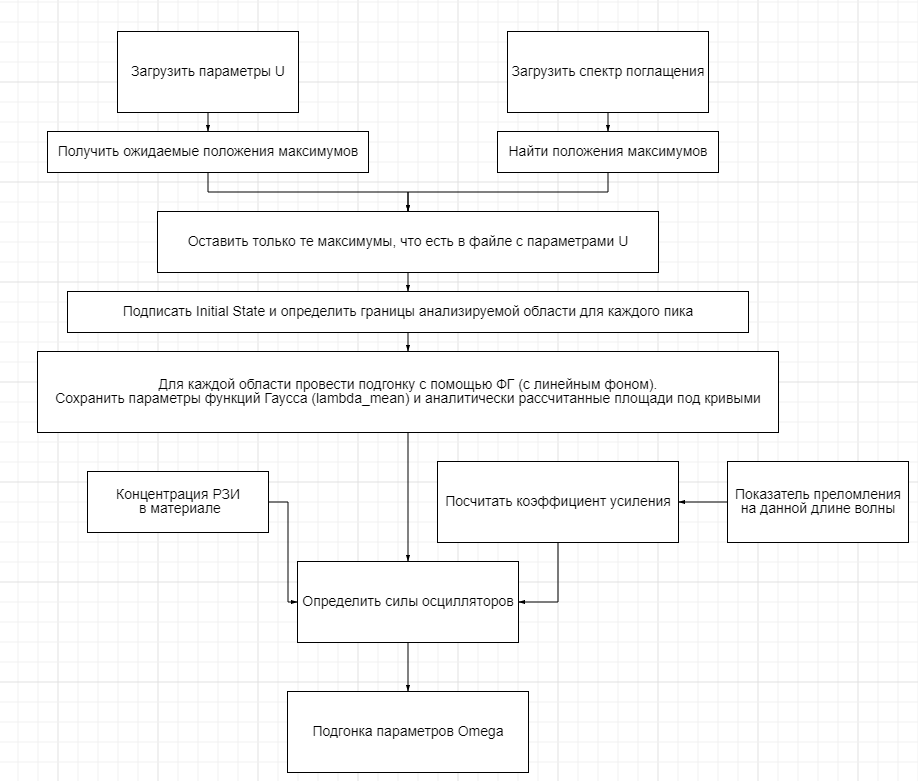
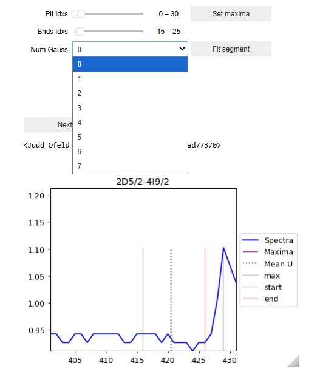
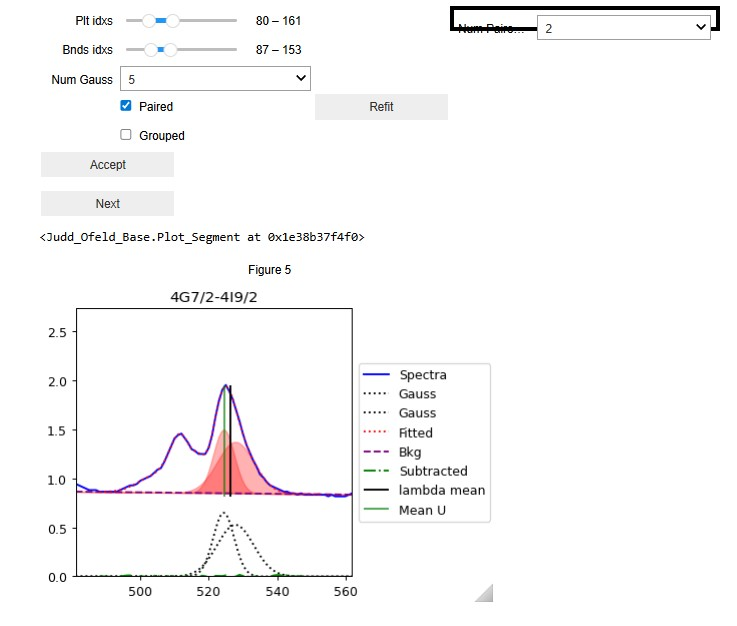
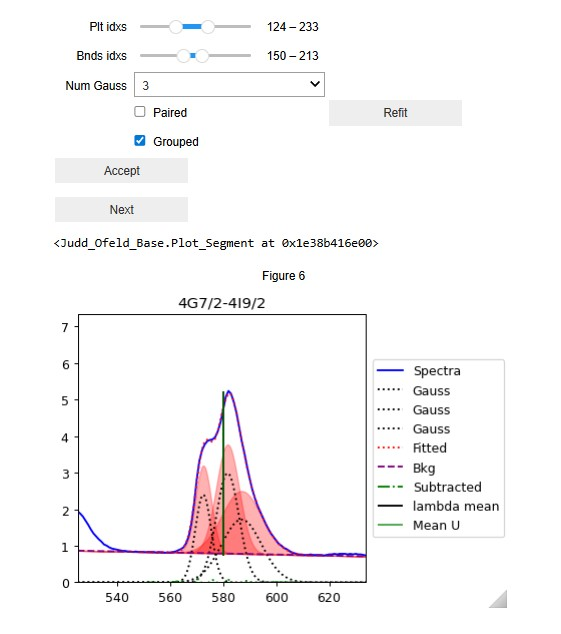

# Judd-Ofelt Base

Проект для анализа спектров поглощения редкоземельных ионов (РЗИ) по теории **Джадда-Офельта** (Judd-Ofelt).

Набор классов и инструментов, позволяющий выполнять расчёты параметров Джадда-Офельта и радиационных характеристик ионов.

### Основные возможности

- Загрузка и предобработка спектров поглощения
- Интерактивная деконволюция полос поглощения с помощью функций Гаусса (Jupyter widgets)
- Ручное определение границ полос
- Учёт перекрывающихся и сгруппированных термов
- Расчёт экспериментальных сил осцилляторов
- Определение параметров интенсивности Ω₂, Ω₄, Ω₆
- Bootstrap и Leave-One-Out анализ стабильности параметров
- Расчёт радиационных характеристик (коэффициенты Эйнштейна A, времена жизни, коэффициенты ветвления)
- Поддержка формулы Селмайера для расчёта показателя преломления

---

## Установка

```bash
pip install -r requirements.txt
```
Для комфортной работы с интерактивными виджетами рекомендуется использовать:
```bash
pip install nbclassic>=1.3.0
jupyter nbclassic
```
---
## Описание блокнотов

- Judd_Ofeld_Base.ipynb — основной блокнот, содержит все необходимые классы и функции.
- Carnal_U_data_prepare_example.ipynb — пример подготовки матричных элементов U из литературных данных (doi: 10.1063/1.1669893).
- J_O_calculation_example.ipynb — полный расчёт сил осцилляторов и параметров Джадда-Офельта.
- J_O_stability_estimation_example.ipynb — оценка стабильности полученных параметров Ω (bootstrap + LOO).
- RadiativeTransitionCalculator_example.ipynb — расчёт радиационных характеристик (A, τ, β).

---

## Общая схема расчёта параметров Judd-Ofelt

Основные этапы:

1) Отсеивание допустимых для рассмотрения полос поглощения
2) Определение площадей под полосами и средних длин волн
3) Расчёт экспериментальных сил осцилляторов
4) Подгонка параметров Ω₂, Ω₄, Ω₆


### Нюансы работы с Judd_Ofelt.set_boundaries_and_fit()
После выполнения фиттинга площадей для каждой полосы поглощения необходимо нажать на кнопки **accept** и **next**.  
Параметр merge_range определяет, объединять ли соседние группы по итоговым Lambda_mean.  
1. Исключение полосы из рассмотрения
Установите Num_Gauss = 0 для соответствующего сегмента.

2. Paired (спаренные) максимумы  
Используется при перекрытии двух разных термов, которые, тем не менее, можно разделить.
Выделяете общую область и указываете количество Гауссиан, соответствующих первым вручную поставленным максимумам.

3. Grouped (сгруппированные термы)  
Применяется когда несколько термов образуют одну неразделимую полосу. 


## Возможные улучшения
1) В текущей реализации, при фиттинге параметров J-O (Judd_Ofeld.fit_omegas) вклады Grouped термов по факту считаются через AUC, что может приводить к неточностям при использовании fit_by='ls'.
2) Аппроксимация полос поглощения функциями Гаусса дает хороший результат, однако обычно форма спектральных линий описывается Лоренцевским профилем (см. https://ru.wikipedia.org/wiki/Профиль_спектральной_линии)
3) Текущая реализация не позволяет единовременно фиттовать несколько спектров.
